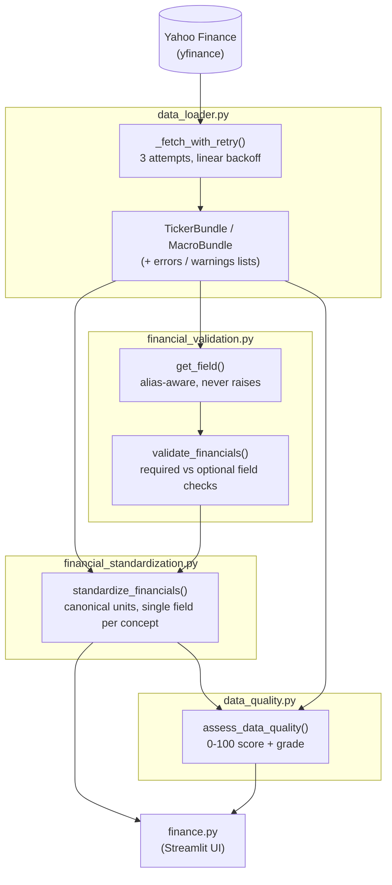

# Quantix Data Architecture

This document describes how data moves through Quantix, from the raw Yahoo
Finance API to the numbers rendered on screen. It exists so future work on
the data pipeline doesn't have to be reverse-engineered from `finance.py`.

The pipeline is split into five modules, each with one job:

| Module | Job |
|---|---|
| [`data_loader.py`](data_loader.py) | Fetch from Yahoo Finance, with retries and per-dataset caching |
| [`financial_validation.py`](financial_validation.py) | Check which statement fields are actually present |
| [`financial_standardization.py`](financial_standardization.py) | Convert raw, inconsistent Yahoo data into one canonical, unit-consistent object |
| [`data_quality.py`](data_quality.py) | Score how trustworthy the resulting data is (0-100) |
| [`fundamental_analysis.py`](fundamental_analysis.py) | Calculate every statement-derived ratio, the scorecard, Altman Z and the DCF — see [`FUNDAMENTALS.md`](FUNDAMENTALS.md) for every formula and assumption |

`finance.py` (the Streamlit app) only ever talks to these five modules — it
never calls `yfinance` directly, never reads a raw `info` dict or statement
DataFrame, and performs no ratio arithmetic of its own. Two supporting modules cut across all of the above:
[`config.py`](config.py) holds every tunable constant (thresholds, defaults,
assumptions), and [`logging_setup.py`](logging_setup.py) configures the one
`quantix` logger tree that each module logs through (see §5).

A parallel, price-history-only pipeline feeds the Technical Analysis
section: [`price_processing.py`](price_processing.py) validates/cleans the
raw OHLCV fetch from `data_loader.py` (duplicate timestamps, invalid bars,
adjusted-close normalization, gap detection), and
[`technical_indicators.py`](technical_indicators.py) calculates SMA, RSI,
MACD, Bollinger Bands, and ATR on the result — see
[`TECHNICAL_ANALYSIS.md`](TECHNICAL_ANALYSIS.md) for every formula,
smoothing convention, and how each was validated.

## 1. Data sources

Everything originates from Yahoo Finance via the `yfinance` package. A
single `yf.Ticker(symbol)` object is the entry point for six kinds of data:

| Dataset | yfinance property | Shape |
|---|---|---|
| Quote / company profile | `.info` | `dict` |
| Price history | `.history(start, end)` | DataFrame, indexed by date |
| Income statement | `.financials` | DataFrame, one column per fiscal year |
| Balance sheet | `.balance_sheet` | DataFrame, one column per fiscal year |
| Cash flow statement | `.cashflow` | DataFrame, one column per fiscal year |
| Institutional holders / insider transactions | `.institutional_holders` / `.insider_transactions` | DataFrame |

Two more datasets are fetched independently of the main ticker:
- **Macro/benchmark data** — the user-selected benchmark symbol, plus `^VIX`
  and `^TNX`, each via `.history(start, end)`.
- **Seasonality data** — 10 years of monthly bars for the main ticker via
  `.history(period="10y", interval="1mo")`, fetched separately from the
  daily price history above since it uses a different period/interval.

Yahoo Finance is unofficial and occasionally inconsistent: field names
change across versions, some tickers legitimately lack certain statements
(ETFs, indices, banks), and requests can be rate-limited or time out. The
rest of this pipeline exists to absorb that unreliability before it reaches
a calculation.

## 2. Processing flow



Concretely, for the ticker under analysis:

1. **`load_ticker_bundle(ticker, start, end, deep=True)`** in `data_loader.py`
   fetches all six datasets (via the sub-fetch functions described in
   §3) and assembles them into a `TickerBundle` dataclass. Any fetch that
   exhausts its retries is recorded in `bundle.errors` (required data) or
   `bundle.warnings` (optional data) — the bundle is always returned, never
   an exception.
2. **`standardize_financials(bundle)`** in `financial_standardization.py`
   converts the raw bundle into a `StandardizedFinancials` object: canonical
   field names, consistent units (percentages as decimals, ratios as plain
   numbers, currency as raw dollars), and no fabricated defaults — a
   genuinely missing field is `None`, except `total_debt` and
   `retained_earnings`, which default to `0` since their absence
   conventionally means "not reported because there isn't any." Internally,
   this step calls `validate_financials()` (from `financial_validation.py`)
   to check field completeness, and the resulting `ValidationReport` is
   attached to `StandardizedFinancials.validation`.
3. **`assess_data_quality(standardized, bundle, macro_bundle)`** in
   `data_quality.py` combines that validation report with data freshness
   and fetch reliability into one 0-100 score (see §4).
4. **`finance.py`** reads only from the `StandardizedFinancials` object and
   the `DataQualityReport` — every calculation (Scorecard, DCF, Altman
   Z-Score, Monte Carlo, etc.) sources its inputs from `standardized.*`
   fields, never from a raw `info` dict or statement DataFrame directly.

The same flow runs for `deep=False` bundles (watchlist scan, peer
comparison), except only `.info` is fetched — steps 2-3 still run, but every
statement-derived field on `StandardizedFinancials` simply comes back
`None`.

## 3. Caching strategy

Each dataset in `data_loader.py` is cached independently with
`@st.cache_data`, using a TTL matched to how often that data actually
changes — not one blanket value for everything:

| Dataset | Function | TTL | Why |
|---|---|---|---|
| Quote / profile (`.info`) | `_load_info()` | 30 min | Semi-real-time fields (price, market cap); shared by every caller for the same ticker |
| Price history | `_load_price_history()` | 1 hour | Daily OHLC bars |
| Financial statements | `_load_financial_statements()` | 24 hours | Change on a quarterly filing cadence — the single biggest reduction in repeated downloads |
| Ownership data | `_load_ownership_data()` | 12 hours | Matches SEC filing cadence (13F quarterly, Form 4 within days) |
| Benchmark / VIX / TNX | `_load_symbol_history()` | 1 hour | Cached per-symbol, so switching the benchmark doesn't refetch VIX/TNX |
| Seasonality (10y monthly) | `load_seasonality_history()` | 24 hours | Effectively static within a day |

This split matters beyond just picking sane TTLs: because each dataset has
its own cache key, changing the sidebar date range only invalidates price
history — it no longer forces a refetch of the (unrelated, unchanged)
financial statements, and switching the benchmark symbol doesn't refetch
VIX/TNX. `load_ticker_bundle()` and `load_macro_bundle()` themselves are
**not** cached — they're cheap glue code that assembles already-cached
sub-fetches, since caching the assembled bundle on top of independently-TTL'd
pieces would risk serving a stale mix once the pieces expire at different
times.

A sidebar "🔄 Force Refresh Data" button calls `clear_all_caches()` to
bypass every TTL on demand.

Every fetch, regardless of dataset, goes through `_fetch_with_retry()`:
up to 3 attempts with linear backoff (1s, 2s), validating the result isn't
empty/malformed before accepting it. A fetch that still fails after 3
attempts returns `(None, error_message)` rather than raising, so one flaky
ticker can't crash the app.

## 4. Validation & data quality

**Field validation** (`financial_validation.py`) checks each of the three
financial statements against a fixed list of expected fields, each marked
required or optional:

- **Balance sheet** — required: Total Assets, Current Assets, Current
  Liabilities, Stockholders Equity, Total Liabilities (Net Minority
  Interest). Optional: Total Debt, Retained Earnings, Inventory.
- **Income statement** — required: Total Revenue, EBIT (falls back to
  Operating Income if EBIT isn't reported), Net Income. Optional: Interest
  Expense, Gross Profit, Operating Income, Pretax Income, Tax Provision
  (absent for banks/financials, which don't report cost of revenue or a
  classified balance sheet).
- **Cash flow** — required: Free Cash Flow.

`get_field()` is the safe accessor behind this: given a list of acceptable
field-name aliases (Yahoo renames these across versions), it returns the
first matching non-null value, or `None` — never a `KeyError`. A missing
*required* field means the affected calculation shows `N/A` downstream
instead of substituting a fabricated value (e.g. a missing Total Debt is
never silently treated as measured-and-zero unless it's the specific
optional field where that's the documented convention).

**Data quality scoring** (`data_quality.py`) combines four signals into one
0-100 score, weighted so that missing required fields — which is what
actually degrades calculations — dominates:

| Signal | Weight | Source |
|---|---|---|
| Required field completeness | 60% | `financial_validation.py` |
| Optional field completeness | 15% | `financial_validation.py` |
| Data freshness | 15% | `info['mostRecentQuarter']` vs. today (full score ≤120 days old, linearly decaying to 0 by 365 days) |
| Fetch reliability | 10% | `bundle.errors` / `bundle.warnings` from `data_loader.py` |

The score maps to a grade — Excellent (≥90), Good (≥75), Fair (≥55), Poor
(below) — displayed at the top of the app as the "Data Quality Report"
before any derived metric is shown, so it's clear up front how much to
trust the analysis that follows.

## 5. Observability

Every module logs through a child of a single `quantix` logger configured in
`logging_setup.py` (`quantix.data_loader`, `quantix.standardization`, ...),
so output can be filtered by origin. Records go to three places at once: a
rotating file (`quantix.log`, ~1 MB × 3 backups), the console, and an
in-memory ring buffer that backs the in-app log viewer.

Events use a structured `event key=value` style via `log_event()`:

```
19:51:09 DEBUG [quantix.data_loader] api.request dataset="AAPL balance sheet" attempt=1
19:51:09 INFO  [quantix.data_loader] api.success dataset="AAPL balance sheet" attempt=1 ms=195
```

The main event families are `api.*` (request/success/retry/failed — one per
real outbound call, since these sit inside the cached loaders),
`bundle.*` / `macro.*` (per-load summaries), `data.missing_*` (statement
field gaps), `quality.assessed`, `calc.error` / `calc.skipped`, and `user.*`
(meaningful input changes and Force Refresh clicks only — Streamlit re-runs
the script on every widget tick, so interactions are diffed against the
previous run rather than logged unconditionally).

A sidebar **Debug logging** toggle raises the level to DEBUG and reveals the
recent-log viewer at the bottom of the page. It is deliberately rendered
before the Force Refresh button: Streamlit discards session state for any
keyed widget not rendered during a run, and Force Refresh's `st.rerun()`
aborts the script early, which would otherwise silently reset the toggle.

## 6. Design principles this pipeline follows

- **One fetch per dataset, ever.** No section of `finance.py` calls
  `yfinance` directly; everything goes through `data_loader.py`.
- **Never raise on bad data.** Every layer degrades to `None` / an empty
  collection / a warning entry instead of throwing — a data problem should
  produce a visible "N/A" or quality flag, not a crash.
- **No fabricated defaults.** A missing field is `None`, not a plausible-
  looking substitute (the explicit, documented exceptions being Total Debt,
  Retained Earnings, and Inventory, where absence has a real accounting
  meaning).
- **Single source of truth per concept.** Where Yahoo exposes the same
  concept two ways (e.g. Total Debt from the balance sheet vs. from
  `info['totalDebt']`, or "current price" from `info['currentPrice']` vs.
  the freshly-fetched price history), `financial_standardization.py` picks
  one canonical source so every section of the app agrees.
